# 音乐推荐系统

#### 介绍
基于SparkStreaming的实时推荐系统


#### 参与贡献

赵龙
张浩
苏文杰
李勇江    


# **项目简介**

本项目是一个基于Spark的分布式音乐推荐系统，旨在通过大数据算法和分布式计算技术，提供高效准确的音乐推荐服务，以满足用户的个性化需求。

## **需求分析**

### **引言**

本需求分析报告旨在详细描述基于Spark的分布式音乐推荐系统的功能和特性，以明确用户需求并为系统设计和开发提供指导。本系统旨在为用户提供个性化的音乐推荐服务，通过分析用户的历史行为和偏好，提供符合其口味的音乐推荐，提升用户体验。

### **用户角色**

1 普通用户：使用系统提供的音乐搜索和播放功能，获取个性化推荐的音乐。

2 管理员用户：管理系统的用户信息、音乐库和推荐算法等，具有系统配置和维护的权限。

### **功能需求**

**1 用户注册和登录**

· 用户可以注册新账号，并通过登录验证身份。

· 用户登录后可享受个性化推荐和其他功能。

**2 音乐搜索**

· 用户可以通过关键词搜索音乐，系统将返回相关的音乐结果。

· 可以支持搜索结果的按照不同条件进行排序和过滤。

**3 音乐播放**

· 用户可以点击音乐结果，进入音乐播放页面进行音乐的在线播放。

**4 个性化推荐**

· 系统根据用户的历史行为和偏好，为用户推荐符合其口味的音乐。

· 推荐算法应考虑音乐分类、用户喜好度等因素，提供个性化推荐结果。

**5 用户喜好管理**

· 用户可以收藏喜欢的音乐，方便快速查找和播放。

· 用户可以取消收藏，管理个人喜好和播放历史。

**6 管理员权限管理**

· 管理员用户可以管理用户的账号信息，包括修改、删除等操作。

· 管理员用户可以管理音乐库，包括添加、编辑、删除音乐信息。

### **非功能需求**

#### **性能要求**

· 系统需要具备高并发处理能力，能够快速响应用户请求。

· 音乐搜索和推荐功能需要在短时间内生成结果并返回给用户。

#### **可用性要求**

· 系统应具备良好的用户界面设计，易于使用和操作。

· 音乐播放功能应稳定可靠，能够流畅地进行音乐播放。

#### **可扩展性要求**

· 系统应具备良好的扩展性，能够支持未来的功能扩展和系统优化。

#### **安全性要求**

· 用户的个人信息应得到保护，系统应采取相应的安全措施。

· 管理员的权限管理应具备安全性，防止未经授权的访问和操作。

### **假设与约束**

· 系统需要连接互联网进行数据的爬取和推荐算法的更新。

· 系统需要具备足够的存储容量来存储音乐库和用户数据。


## **项目架构**

本项目采用了分布式计算技术，基于Spark框架，实现了数据的分布式处理和计算。具体架构如下：

数据采集模块：采用爬虫技术获取音乐相关的数据，包括歌曲信息、评论信息、用户信息等。

数据处理模块：对采集到的数据进行清洗和处理，将处理后的数据进行存储和索引。

算法模块：采用机器学习算法和推荐算法，对用户的历史行为和偏好进行分析，为用户推荐符合其偏好的音乐。

web前后端模块：提供用户接口，用户可以通过该接口进行音乐的搜索和播放。

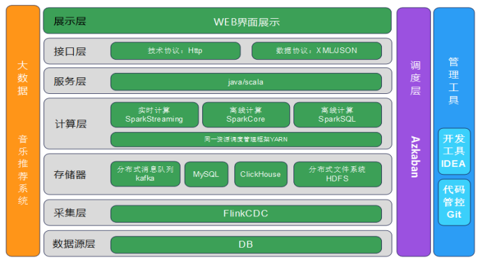

## **业务流程**

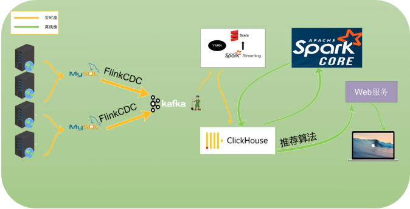

## **集群部署情况**

2台4H8G 3台4H4G 的CentOS 操作系统

spark101-spark105为主机名。

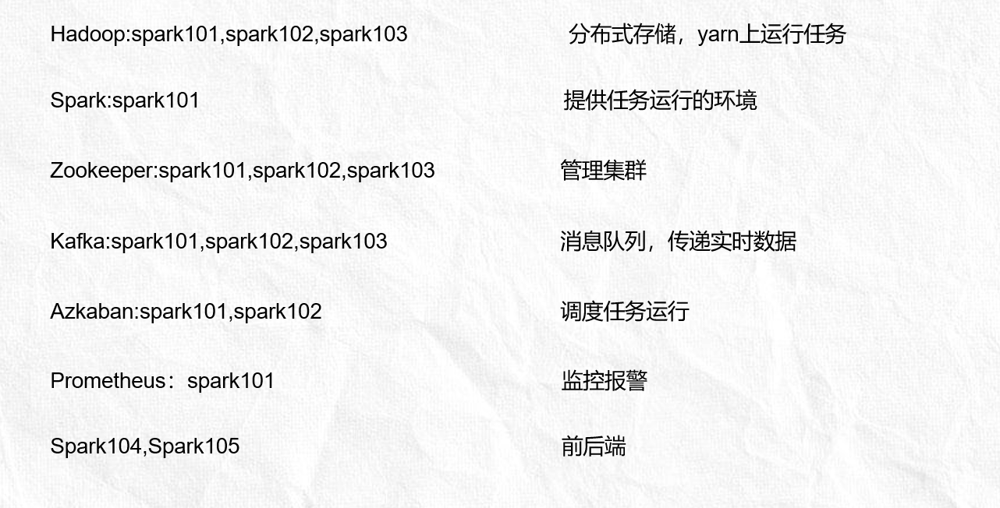

使用FlinkCdc处理数据变化

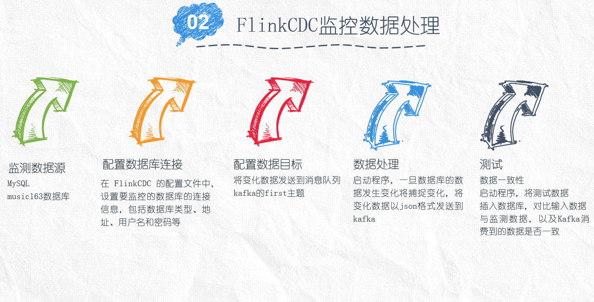

# 组织形式

本项目采用敏捷开发模式，每个迭代周期为两周，包含需求分析、设计、编码、测试、部署和迭代回顾等环节。咱们团队采用周例会和迭代计划会议进行沟通和协调，以保证项目的进展和质量。

该组织架构下包含三种角色，分别是产品负责人（Product Owner）、敏捷教练（Scrum Master）、团队（team）。

产品负责人（Product Owner）简称PO，仅能由一个人来担任，类似产品经理，担任项目的管理者，但不需要管理团队。负责制定产品策略，参与产品架构和技术讨论，负责产品迭代计划的审核与推进。

敏捷教练（Scrum Master）简称SM，仅能由一个人来担任，作为敏捷开发的推动者，需要管理团队，擅长组织和协调。负责组织会议，整理会议纪要，制定迭代计划，推进产品开发。

团队（team）是产品的创造者，是真正的技术执行者。通常包括前端开发工程师、后端开发工程师、测试工程师、UI设计师、运维工程师等。团队队员之间没有头衔、上下级之分，成员之间平等沟通和协作。

## **团队成员**

张浩 产品经理

赵龙 敏捷教练

苏文杰 团队成员

李勇江 团队成员

## **人员分工**

1. 张浩：负责爬虫部分的开发和调度监控的部署；

2. 赵龙：负责数据库设计和算法部分的开发以及整理文档；

3. 苏文杰：负责Web前后端部分的开发和CDC的开发；

4. 李勇江：负责服务器环境部署和算法部分的开发。

## **组织沟通与协作**

为了实现高效的团队沟通与协作，我们将采用以下方式：

1. 每周举行一次团队例会，在例会上分享项目进展、讨论遇到的问题并寻找解决方案。

2. 使用在线沟通工具（如钉钉、微信等）建立团队沟通渠道，方便随时交流和解决问题。

3. 每个迭代周期开始前，进行迭代计划会议，明确本周期的目标和任务分配。

4. 团队成员之间保持持续的沟通和协作，协助彼此解决遇到的问题，确保项目进展顺利。

5. 定期进行迭代回顾，总结经验教训，不断优化工作流程和团队效率。

## **项目进度安排**

根据项目需求和团队成员的能力分配，我们拟定以下进度安排：

1. 第一周：进行项目需求分析和功能规划，制定初步的项目计划和迭代周期。

2. 第二周至第四周：进行数据采集模块的开发，包括爬虫技术的研发和数据清洗处理的设计与实现。

3. 第五周至第七周：着手开发算法模块，包括机器学习算法和推荐算法的实现和优化。

4. 第八周至第十周：进行web前后端模块的开发，包括用户接口的设计和实现。

5. 第十一周至第十二周：进行系统的测试和调试，确保各个模块的功能完善和稳定。

6. 第十三周：项目部署和上线准备，包括服务器环境部署、性能优化和安全性测试等。

7. 第十四周：逐步上线并进行用户反馈收集，持续进行迭代优化和功能迭代。

## **风险管理**

在项目开发过程中，我们将要面临一些潜在的风险，以确保项目进展顺利：

1. 需求变更风险：对于长期项目，需求的变更是难以避免的，我们将确保及时沟通和调整，尽量减少变更带来的影响。

2. 技术挑战风险：分布式计算和大数据算法是本项目的核心，在技术实现中可能会遇到一些挑战，我们将及时进行技术调研和解决方案讨论。

3. 进度延误风险：对于每个迭代周期，我们会进行合理的时间规划和任务分配，确保能够及时完成计划的工作。

4. 团队协作风险：团队成员之间的沟通和协作是项目成功的关键，我们将重视团队合作，妥善解决团队成员之间的沟通和协作问题。

# **功能模块设计**

爬虫设计

在音乐推荐系统的开发过程中，设计爬虫获取数据的阶段具有重要的意义。该阶段的主要目标是通过爬取各种音乐平台、社交媒体和网站上的数据，建立一个全面、多样化的音乐数据库。

这个阶段的核心效果是获取大量的音乐相关数据，包括歌曲信息、艺术家资料、歌词、歌曲标签、用户评论等。通过将这些数据组织和分析，可以构建一个全面的音乐库，为后续的推荐算法提供丰富的素材和依据。

这个阶段对后续开发的影响非常重要。首先，一个全面、多样化的数据集是进行推荐算法训练的基础。只有拥有丰富的数据样本，算法才能更好地理解用户的偏好和行为，从而提供个性化的推荐。

其次，爬虫获取的数据也可以用于数据清洗和预处理。通过对数据进行清洗和标准化处理，可以提高数据的质量和准确性，减少后续算法开发中可能出现的问题。

此外，数据获取阶段还可以帮助发现新的音乐趋势和热门曲目，为推荐系统的更新和优化提供参考。通过观察和分析数据，可以及时调整推荐策略，使系统的推荐结果更符合用户的兴趣和口味。

总之，设计爬虫获取数据的阶段是音乐推荐系统开发中不可或缺的一步。它为后续算法训练、数据清洗和优化提供了基础，并且对于打造更好的用户体验和个性化推荐非常关键。

数据源选择

QQ音乐和网易云音乐都是知名的音乐平台，它们各自具有不同的特点和优势。在选择唯一数据来源时，需要考虑这些因素并做出合适的选择。下面是对两个数据源的特点和网易云音乐的优势的分析：

**1.** **QQ音乐的特点和优势：**

- 数据相对齐全：QQ音乐作为中国领先的音乐平台之一，拥有广泛的音乐资源和大量用户。它提供了丰富的音乐库，包括热门流行歌曲、专辑、歌手等。
-  音乐版权：QQ音乐在版权方面相对较强，与国内外多家音乐公司有合作关系，因此可以提供具有版权的高质量音乐资源。

**2.** **网易云音乐的特点和优势：**

-  开源数据接口服务器：网易云音乐提供了开源数据接口服务器，这是对开发者非常友好的特点。开发者可以通过这些接口获取音乐数据，便于数据的获取和整合。
-  用户互动和社交性：网易云音乐注重用户互动和社交功能的建设，用户可以在平台上评论、点赞、分享音乐，形成良好的社区氛围。这些用户行为数据可以为个性化推荐提供更多的依据。

**综合考虑，选择网易云音乐作为唯一的数据来源有以下几点论证：**

- 开源数据接口服务器：网易云音乐的开源数据接口服务器对开发者友好，提供了便捷的数据获取方式，有利于系统的开发和维护。
-  用户互动和社交性：网易云音乐的用户互动功能和社交性更加突出，这意味着可以获取到更多的用户行为数据，从而为个性化推荐算法提供更准确的依据。
-  数据相对齐全：虽然QQ音乐在数据方面有一定的优势，但网易云音乐也拥有广泛的音乐资源，并且其开源数据接口服务器可以通过其他渠道补充数据，以弥补潜在的不足。

因此，在综合考虑开发者友好性、用户互动和社交性以及数据资源等因素后，选择网易云音乐作为唯一的数据来源是合理的决策。

需求分析

1. 目标：获取音乐信息和对应标签的数据，以满足后续的推荐服务需求。

2. 数据源：选择网易云音乐作为唯一的数据来源。

3. 数据获取方式：
   -  利用网易云音乐的开源数据接口服务器，通过 API 请求，获取音乐数据。
   -  可以根据不同的需求，获取特定类型的音乐数据，如热门榜单、推荐歌单、某个歌手的专辑等。
   -  获取的音乐数据应该包括音乐ID和对应的标签。

4. 音乐ID和标签的存储：
   - 设计数据库模式，存储音乐ID和相应的标签。
   -  数据库中的音乐ID应该是唯一的，方便后续的数据检索和操作。
   -  标签可以根据需求进行分类和组织，例如根据流派、风格、专题等进行标签分类。

5. 数据更新和维护：
   -  设置定时任务，定期更新数据库中的音乐数据，保证数据的及时性和准确性。
   -  对于新增的音乐数据，需要通过爬虫或API请求获取对应的音乐ID和标签，并插入到数据库中。
   -  可以考虑建立自动化流程，实现数据爬取、处理和存储的自动化操作。

6. 数据查询和检索：
   -  提供合适的接口和查询功能，便于根据标签或其他条件进行音乐数据的查询和检索。
   -  根据用户的请求和需求，通过查询数据库获取相应的音乐ID和标签数据。

7. 数据质量和准确性：

-  数据获取过程中，需要处理重复、缺失或错误的数据，确保数据的质量和准确性。

-  可以通过数据清洗和验证等方式，对获取到的音乐ID和标签进行处理和校验，确保数据的完整性和一致性。

总结：以上需求分析主要从数据源选择、数据获取方式、数据存储、数据更新维护、数据查询和检索以及数据质量方面对获取音乐ID和对应标签的需求进行了分析。根据这些需求，可以设计和实现相应的音乐数据获取系统，以满足后续的推荐服务的需求。

**技术栈**

**1.** **网络爬虫：**使用网络爬虫技术从网易云音乐获取音乐数据。网络爬虫模块可以使用Python中的各种爬虫框架，如Scrapy等。

**2.** **Scrapy：**Scrapy是一个强大的Python爬虫框架，它提供了一套丰富的API和工具，使得爬虫开发更加高效和灵活。

**3.** **XPath：**XPath是一种用于在XML和HTML文档中进行导航和提取数据的查询语言。在爬虫过程中，XPath可以用于从网页中提取指定的数据。

**4.** **JSON：**JSON是一种常用的数据交换格式，它以易于阅读和编写的方式存储数据。在爬虫过程中，爬取的数据通常以JSON格式进行处理和存储。

**5.** **CSV：**CSV是一种常用的纯文本格式，以逗号作为字段的分隔符。在数据处理过程中，可以使用CSV格式将数据导出或导入到文件中，方便进行数据存储和交换。

**6.** **Pandas：**Pandas是一个强大的数据处理和分析库，它提供了高性能的数据结构和数据分析工具。在数据处理和分析阶段，可以使用Pandas进行数据的清洗、转换和分析。

**7.** **MySQL：**MySQL是一种流行的关系型数据库管理系统，提供了高效可靠的数据存储和查询功能。在数据存储的阶段，可以使用MySQL作为数据库管理系统，存储爬取的音乐ID和标签等数据。

综合上述技术栈，可以使用网络爬虫框架Scrapy进行网易云音乐数据的爬取，使用XPath进行数据提取，将爬取的数据以JSON格式进行处理和存储。在数据分析和处理阶段，可以使用Pandas进行数据的清洗、转换和分析，并将数据导出或导入到CSV格式的文件中。最终，可以使用MySQL作为数据库管理系统，存储爬取的音乐ID和对应的标签数据。

总体设计

**数据表设计**

分类表

| 字段名 | 字段属性                  | 注释     |
| ------ | ------------------------- | -------- |
| id     | Unsigned int, Primary key | 自增主键 |
| Cate   | Varchar(255)              | 主分类   |
| Scate  | Varchar(255)              | 子分类   |

 

音乐分类表

| 字段名 | 字段属性                     | 注释                   |
| ------ | ---------------------------- | ---------------------- |
| id     | Unsigned bigint, Primary key | 自增主键               |
| url    | Varchar(255)                 | 音乐地址，网易云音乐id |
| title  | Varchar(255)                 | 音乐标题               |
| cate   | Varchar(255)                 | 音乐子分类             |

 

音乐信息表

| 字段名     | 字段属性                     | 注释         |
| ---------- | ---------------------------- | ------------ |
| id         | Unsigned bigint, Primary key | 自增主键     |
| music_id   | Varchar(255)                 | 网易云音乐id |
| music_name | Varchar(255)                 | 音乐标题     |
| url        | Varchar(255)                 | 音乐地址     |

 


 

艺术家表

| 字段名 | 字段属性                     | 注释           |
| ------ | ---------------------------- | -------------- |
| id     | Unsigned bigint, Primary key | 自增主键       |
| artist | Varchar(255)                 | 网易云艺术家id |
| name   | Varchar(255)                 | 艺术家名       |

 

音乐-艺术家表

| 字段名    | 字段属性                     | 注释         |
| --------- | ---------------------------- | ------------ |
| id        | Unsigned bigint, Primary key | 自增主键     |
| music_id  | Varchar(255)                 | 网易云音乐id |
| atrist_id | Varchar(255)                 | 艺术家id     |

 

专辑表

| 字段名 | 字段属性                     | 注释         |
| ------ | ---------------------------- | ------------ |
| id     | Unsigned bigint, Primary key | 自增主键     |
| album  | Varchar(255)                 | 网易云专辑id |
| title  | Varchar(255)                 | 专辑标题     |
| pic    | Varchar(255)                 | 专辑封面地址 |
| time   | Datetime                     | 发布时间     |

 

音乐-艺术家表

| 字段名   | 字段属性                     | 注释         |
| -------- | ---------------------------- | ------------ |
| id       | Unsigned bigint, Primary key | 自增主键     |
| music_id | Varchar(255)                 | 网易云音乐id |
| album_id | Varchar(255)                 | 专辑id       |

 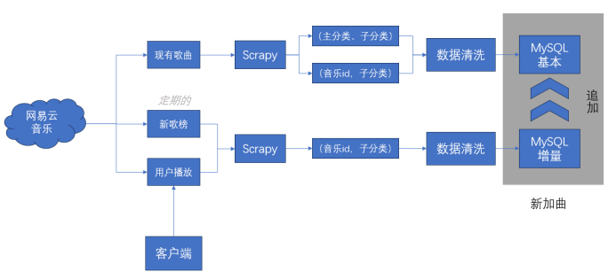

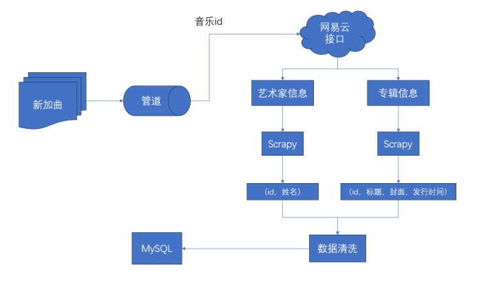

详细设计

**基本数据获取**

对于这个流程，可以使用Scrapy作为网络请求工具。Scrapy是一个强大的Python爬虫框架，它提供了方便的异步网络请求和XPath解析功能，非常适合用于爬取网易云音乐的歌单数据。

具体的流程如下：

1. 创建一个Scrapy项目，并配置合适的爬虫设置。

2. 在爬虫类中定义start_urls，设置为网易云音乐主页地址。

3. 在爬虫类的parse方法中，解析主页的HTML代码，使用XPath提取歌单列表页链接。可以使用Scrapy提供的Selector和xpath方法来实现。

4. 在parse方法中，访问歌单列表页链接，在回调函数中处理列表页的HTML源码。

5. 在回调函数中，使用XPath解析歌单列表页，提取出歌单信息和分类方式的相关数据。将分类方式写入CSV文件，并依次访问歌单链接。

6. 在回调函数中，继续使用XPath从歌单页的HTML源码中解析出歌单标签和音乐列表的相关信息。

7. 将解析得到的音乐地址、音乐标题和标签整理成字典形式，并使用Scrapy提供的yield语句将数据传递给管道进行处理。

8. 创建管道类，在管道类的process_item方法中，将音乐数据写入CSV文件。

9. 使用Pandas加载CSV文件，进行去重和去空值的清洗操作，生成清洗后的结果。

10. 连接到MySQL数据库，在数据库中创建表格用于存储音乐数据。使用Python的MySQL库，将清洗后的音乐数据插入到MySQL数据库表格中。

以上流程利用Scrapy作为网络请求工具，实现了从网易云音乐获取歌单数据并存储到MySQL数据库的功能，同时使用XPath进行HTML解析，并利用Pandas进行数据清洗操作。

**增量数据获取**

对于这个流程，可以使用Scrapy作为网络请求工具。Scrapy是一个强大的Python爬虫框架，它提供了方便的异步网络请求和XPath解析功能，非常适合用于爬取网易云音乐的歌曲数据。

具体的流程如下：

1. 创建一个Scrapy项目，并配置合适的爬虫设置。

2. 在爬虫类中定义start_urls，设置为网易云音乐主页地址。

3. 在爬虫类的parse方法中，解析主页的HTML代码，使用XPath提取榜单页链接。可以使用Scrapy提供的Selector和xpath方法来实现。

4. 在parse方法中，访问榜单页链接，在回调函数中处理榜单页的HTML源码。

5. 在回调函数中，使用XPath解析榜单页，提取出新歌榜的链接，访问新歌榜的链接。

6. 在回调函数中，使用XPath解析新歌榜，依次请求新歌链接，获取音乐页的HTML源码；对于用户播放记录，直接请求到对应音乐页的HTML源码。

7. 在回调函数中，使用XPath解析音乐页源码，提取出包含该歌曲的歌单信息和标签。

8. 将解析得到的音乐地址、音乐标题和标签整理成字典形式，并使用Scrapy提供的yield语句将数据传递给管道进行处理。

9. 创建管道类，在管道类的process_item方法中，将音乐数据写入MySQL数据库，并在写入之前确保该记录在数据表中不存在，以避免重复记录。

10. 对于没有被任何歌单收录的歌曲，手动打上另类、独立的标签。

以上流程利用Scrapy作为网络请求工具，实现了从网易云音乐获取新歌数据并存储到MySQL数据库的功能，同时使用XPath进行HTML解析，并在写入数据之前进行去重判断。使用Scrapy框架的异步请求和优雅的数据流处理机制来处理大量的数据，可以让爬虫更加高效和稳定。

**音乐信息获取**

这个流程可以分为以下几个步骤：

1. 从磁盘读取新加曲编号列表：首先，从磁盘上读取包含新加曲编号的文件。这个文件可以是一个文本文件或者其他适合存储编号的文件格式。读取文件并获取编号列表。

2. 使用网易云接口查询歌曲、艺术家和专辑信息：使用网易云的接口，将每个编号作为参数，逐个查询歌曲的艺术家和专辑信息。发送请求至网易云接口，并解析返回的数据，获取艺术家和专辑信息。

3. 检查数据是否存在：在将数据保存到数据库之前，需要进行检查以确保在数据库表中没有重复记录。可以根据艺术家编号、专辑编号以及歌曲编号来进行检查。

4. 保存艺术家信息：将查询到的艺术家信息（艺术家编号，艺术家名）保存到艺术家信息表中。如果艺术家已存在于表中，则不进行插入操作。

5. 保存专辑信息：将查询到的专辑信息（专辑编号，标题，封面，发行时间）保存到专辑信息表中。同样地，如果专辑已存在于表中，则不进行插入操作。

6. 保存歌曲-艺术家关联信息：将歌曲的编号和艺术家的编号保存到歌曲-艺术家关联表中。检查关联关系是否已存在于表中，避免重复插入。

7. 保存歌曲-专辑关联信息：将歌曲的编号和专辑的编号保存到歌曲-专辑关联表中。同样地，检查关联关系是否已存在于表中，避免重复插入。

以上是整个流程的步骤描述，从磁盘读取新加曲编号，通过网易云接口查询歌曲、艺术家和专辑信息，并将这些信息保存到对应的数据库表中，同时在写入之前确保记录在数据表中不存在。通过这个流程，可以实现从网易云接口获取详细歌曲信息并进行持久化存储的功能。

编码实现

此部分介绍使用Python语言基于Scrapy框架编写爬虫的实现步骤和相关代码示例。通过编写Scrapy爬虫，可以实现从目标网站获取数据，并将数据存储到指定的存储介质中。

**环境准备**

确保已安装Python和Scrapy框架，并保证所需的依赖库已安装。可以使用以下命令安装Scrapy框架：

```shell
pip install scrapy
```

**创建Scrapy项目**

使用Scrapy提供的命令行工具创建一个新的Scrapy项目：

```shell
scrapy startproject project_name
```

**定义爬虫**

在Scrapy项目中，进入爬虫项目目录，创建一个爬虫文件，并打开编辑。例如：

```shell
cd project_name
scrapy genspider spider_name website_url
```


## **算法设计**

### **背景及意义**

背景：需要实现个性推荐的功能，需要使用算法分析各个用户的喜好，并根据其喜好给该用户推荐类似的音乐

意义：实现对用户的精准推荐

### **总体设计**

#### **相关数据库表设计**

1、音乐推荐表

| 字段名            | 数据类型      | 注释                  |
| ----------------- | ------------- | --------------------- |
| user_id           | Int64         | 用户id（primary key） |
| recommended_music | Array(String) | 推荐的音乐id          |

 

#### **算法的选择**

1、协同过滤算法：

基于用户的协同过滤（User-Based Collaborative Filtering）：该方法通过分析用户之间的相似性来进行推荐。当一个用户喜欢某个项目时，系统会找到与该用户兴趣相似的其他用户，并将这些用户喜欢的项目推荐给当前用户。

基于物品的协同过滤（Item-Based Collaborative Filtering）：该方法通过分析项目之间的相似性来进行推荐。当一个用户喜欢某个项目时，系统会找到与该项目相似的其他项目，并将这些相似项目推荐给当前用户。SVD就是其中一种。

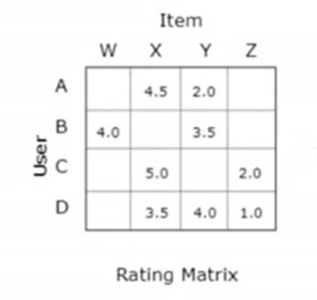

2、ALS算法：

ALS算法是一种用于解决协同过滤问题的优化算法。它通过交替优化用户向量和项目向量来求解最佳的推荐模型。

ALS算法的核心思想是通过最小化损失函数来学习用户和项目的隐含特征向量，使得预测评分尽可能接近实际评分。在每次迭代中，先固定用户向量，通过最小二乘法求解最佳的项目向量；然后再固定项目向量，通过最小二乘法求解最佳的用户向量。通过多次迭代，逐步优化模型参数，直到收敛为止。

ALS算法的优点是可以处理稀疏数据，且能够并行计算，适用于大规模推荐系统。 

#### **推荐流程**

通过协同过滤和ALS相结合的方式，为该用户推荐符合其喜好的音乐，将推荐结果去重后写入对应表中，前端读取后展示音乐详情在界面

 

**热门音乐推荐**

从clickhouse的music_partition表得到最新一天用户对音乐的数据（播放量，收藏量，点赞量，评论次数，分享次数），将这些数据相加得到用户对某音乐的总体得分，选择得分最高的20首音乐作为热门音乐推荐，写入music_popular表中。

 

**新歌推荐**

从clickhouse的music_profile表获得音乐详情，根据时间戳排序获得最新的20首歌曲进行推荐，写入music_new表中。

 

 

**热门歌手推荐**

从clickhouse的music_partition表得到最新一天用户对音乐的数据（播放量，收藏量，点赞量，评论次数，分享次数），将这些数据相加得到某音乐的总体得分，再与music_profile根据music_id进行连接获得各个音乐的歌手，再根据歌手进行分组后将音乐得分求和，获得某歌手的总得分（歌手各个音乐的得分的和），选择歌手的总得分前几名，最后与artist表相连接得到热门歌手的详细信息，写入singer_popular表中。

 

**用户活跃量**

读取mysql的new_user_action的数据，用filter得到昨天的全部用户操作数据，再根据uid进行去重，可以获得昨天的用户活跃量，将其数据加上日期写入clickhouse的user_active表中。

 

**Vip复购率**

读取mysql的new_user_action的数据，用filter得到上个月的全部用户操作数据且操作字段（oc）为‘b’的数据（表示购买操作），根据uid进行分组，获得每个人该月的购买次数，将购买次数大于一的人数除以总的购买人数，获得该月的复购率，写入vip_repurchase表。

 

 

**个性化音乐推荐**

从clickhouse的uid_music表获得各个用户对某音乐的播放次数，以及个人的总听歌次数，用某音乐的播放次数除以个人总听歌次数获得某用户对某音乐的评分。之后通过协同过滤算法推算得到各个用户对所有音乐的评分，推荐评分最高的5首音乐，过程中通过svd降维矩阵进行降维来加快运算。

 

### **详细设计**

  （1）协同过滤

1、采用基于物品的推荐

2、以用户播放某首音乐的次数，除以该用户的总音乐播放次数为评分

3、基于上述评分建立音乐-评分矩阵

4、通过机器学习内置算法推导其他音乐评分

5、选定评分高的音乐作为推荐音乐

6、将推荐的音乐写入数据库

  （2）ALS算法

  1、采用基于用户的推荐

2、以用户对某首音乐的正向操作次数为评分

3、基于上述评分建立音乐-评分矩阵

4、通过spark内置算法推导其他音乐评分

5、选定评分高的音乐作为推荐音乐

6、将推荐的音乐写入数据库

## **Mook设计**

### **Mook**

"Mook"是一种在开发早期阶段用于模拟数据的技术。它允许我们生成随机的、虚拟的数据，以模拟真实数据的流通性和行为。使用Mook数据进行测试的原因有以下几点：

\1. 模拟真实环境：在音乐推荐系统开发初期，往往缺少实际用户生成的海量行为数据。使用Mook数据可以为我们提供模拟的用户行为和数据流，以模拟真实环境中的数据交互和流通情况。

\2. 快速测试原型：在系统开发的早期阶段，通常会有各种新想法和概念需要验证。使用Mook数据可以快速创建原型并进行测试，而无需等待真实用户的数据产生。这使得我们可以更快地迭代和调整系统，在保证一定准确性的前提下进行快速试验和原型构建。

\3. 覆盖边缘情况：使用Mook数据可以使我们模拟各种边缘情况，例如极端用户行为、异常数据或是不常见的使用场景等。这可以帮助我们在开发初期就发现潜在的问题并提前做出相应的优化或调整。

\4. 数据一致性和控制：使用Mook数据，我们可以精确控制生成的数据和数据流，以保持数据的一致性。我们可以定制化生成特定类型的数据，生成符合特定测试需求的数据集。这样可以更好地进行系统测试，并且可以固定和重复特定的测试场景。

当然，在使用Mook数据进行测试时，我们也要清楚地意识到它只是模拟真实数据的一种近似方法。因此，在系统开发成熟后，我们仍然需要通过真实用户的行为数据来验证和调整系统。-· 

### **Mook数据的方法**

在开发和测试过程中，可以使用不同的方法来生成Mook数据。以下是几种常见的方式：

\1. 随机生成数据：通过编写代码或使用工具，可以生成随机的、虚拟的数据。例如，对于音乐推荐系统，可以通过随机生成用户、歌曲、评论等信息来模拟真实环境下的数据。

\2. 使用伪造数据生成器：有一些开源工具和库可以帮助生成伪造数据，这些数据可以具有一定的结构和规则。例如，Faker是一个流行的Python库，可以生成各种随机的、虚拟的数据，包括姓名、地址、日期等。

\3. 实际数据采样和变换：当有一些真实数据可用时，可以从这些数据中采样并进行变换，生成基于真实数据的Mook数据。例如，可以对真实用户行为数据进行采样，并进行一些变换（如随机修改、用户行为重复）来生成模拟数据集。

\4. 真实数据的子集：如果有一部分真实数据可用，可以选择使用其中的一部分作为Mook数据。根据需要，可以选择特定条件下的数据子集，以覆盖不同的测试场景。

使用哪种方式生成Mook数据取决于具体的需求和资源可用性。在选择方法时，需要考虑数据的准确性、数据量的充分性以及对测试场景的覆盖程度。同时，需要确保生成的Mook数据可以有效地模拟真实环境中的数据流通性和用户行为。

这里考虑使用Python脚本生成Mook数据。

### **Python** **Mook**

使用Python脚本生成Mook数据有以下几个原因：

\1. 简单易学：Python是一门易于学习和使用的编程语言，具有简洁的语法和直观的语言结构。这使得编写Python脚本生成Mook数据相对容易，无论是对于新手还是有经验的开发人员来说，都能快速上手并编写出功能强大的脚本。

\2. 丰富的数据处理库和工具：Python拥有许多强大的数据处理库和工具，例如NumPy、Pandas和faker等。这些库提供了丰富的功能和方法，使得生成各种类型的Mook数据变得更加容易。例如，使用faker库可以轻松生成具有各种特定格式的虚拟数据，如姓名、地址、电子邮件等。

\3. 可拓展性和灵活性：Python是一门高度可拓展的语言，可以轻松地集成其他第三方库或工具。这意味着您可以使用Python来生成复杂和多样化的Mook数据，以满足不同的测试需求。无论是生成大量的随机数据、模拟特定的用户行为还是定制化生成特定格式的数据，Python都可以提供相应的解决方案。

\4. 生态系统的支持：Python拥有活跃的生态系统，有许多开源工具和社区资源可供使用。这意味着您可以从社区中获取海量的示例代码、文档和指导，以帮助您更快地编写生成Mook数据的Python脚本。无论您遇到什么问题，几乎可以肯定会有其他开发人员在Python社区中分享相关经验和解决方案。

综上所述，Python的轻量简单易学的特性、丰富的数据处理库和工具、可拓展性和灵活性，以及强大的社区支持，使其成为生成Mook数据的理想选择。使用Python脚本能够帮助开发人员以高效和灵活的方式生成各种类型的Mook数据，以用于测试和开发过程中的数据模拟和验证。

### **总体设计**

Python Mook的设计包含两个模块：load和mook，它们分别负责加载预置数据和处理Mook数据生成的逻辑。以下是对这两个模块的详细描述：

\1. load模块：

o load 模块负责加载预置数据，包括音乐列表、操作类型列表等。这些预置数据是在Mook数据生成过程中所需的基础数据，用于构建生成Mook数据所需的上下文和参考。

o 在这个模块中，可以通过读取文件、调用API或从数据库中获取预置数据。根据具体需求，可以采用不同的方法和数据源来加载预置数据。

o 一旦数据加载完成，它们可以被传递到 mook 模块中作为参数，以供后续的数据生成和处理使用。

\2. mook 模块：

o mook 模块是 Python Mook 的核心部分，负责处理Mook数据生成的逻辑。

o 在这个模块中，可以编写生成Mook数据的算法、规则和逻辑。根据项目的需求，可以定义生成数据的条件、数据结构和生成策略。

o 使用预置数据作为输入，mook 模块可以根据指定的规则和算法生成符合条件的Mook数据。这些数据可以包括模拟用户行为、生成假数据、构建特定场景等。

o 在生成数据时，可以使用 Python的基本数据结构、列表、字典等，并借助第三方库来处理数据和生成特定格式的数据。

通过将预置数据加载和Mook数据生成的逻辑分离成两个模块，Python Mook的架构更加模块化和可扩展。这种设计模式使得每个模块都有明确的功能和责任，并可以单独测试和调试，提高了代码的可读性和可维护性。

总而言之，load 模块负责加载预置数据，mook 模块负责处理Mook数据生成的逻辑。两个模块的协作能够实现灵活且高效的Mook数据生成功能。

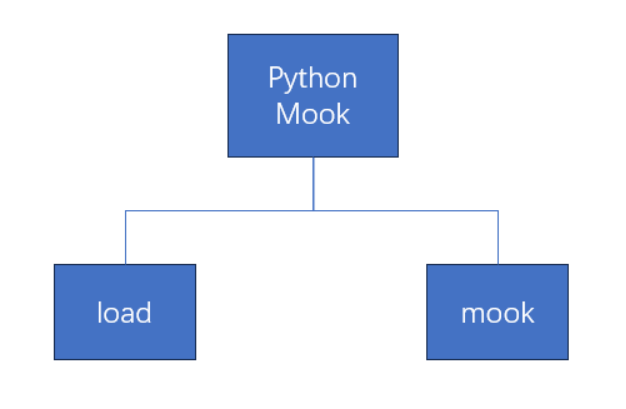

## **SpringAPI**

在音乐推荐系统中，推荐结果通常根据不同的算法和数据源而存储在各个数据库的不同表中。这样的存储方式给前端获取推荐结果带来了一定的困扰，需要分别访问和处理不同的数据库和表。为了简化前端对推荐结果的访问和展示，需要提供一个统一的接口。

### **框架选择**

Springboot是面向该场景的一个可行的解决方案。使用Springboot进行API设计有以下理由和意义：

**·** **多数据源支持：**Springboot框架提供了多数据源配置的能力，可以同时连接多个数据库。这样可以轻松地访问和处理不同数据库的推荐结果，避免了繁琐的数据库连接和操作过程。

**·** **简化前端访问：**通过提供统一的接口，前端只需调用一个API即可获取推荐结果，无需关心具体的数据库和表结构。这样简化了前端的开发流程，提高了开发效率。

**·** **用户交互处理：**Springboot可以通过处理用户交互事件，如点击、收藏等，来实时更新推荐结果和用户行为数据。这样可以提供个性化的推荐体验，并持续优化推荐结果。

**·** **运行监控：**Springboot提供了监控和管理应用程序的功能，可以实时监控API的运行情况和性能指标，帮助开发团队及时发现和解决问题，确保系统的稳定性和可靠性。

### **需求分析**

#### **功能需求**

o 实现一个统一接口，用于前端获取音乐推荐结果并进行页面展示。

o 提供以下五个功能接口：

§ 热门音乐接口：用于获取热门音乐的推荐结果。

§ 热门艺术家接口：用于获取热门艺术家的推荐结果。

§ 个性推荐接口：根据用户id获取个性化的音乐推荐结果。

§ 搜索接口：根据搜索类型和关键词在曲库内搜索对应内容。

§ 用户操作接口：用于处理用户的操作事件。

#### **数据需求**

o 音乐推荐结果保存在不同数据库的不同表中，需要通过配置多数据源，实现数据源的切换。

o 需要根据不同的推荐类型（热门音乐、热门艺术家、个性推荐等）从相应的数据库表中查询结果。

#### **用户界面**

o 前端需要与后端进行交互，并通过提供的统一接口获取推荐结果进行页面展示。

o 前端可以根据用户的交互事件，调用用户操作接口上传用户操作至服务器。

#### **非功能需求**

o 性能要求：接口需要在合理的时间内返回推荐结果，保证用户的流畅体验。

o 可扩展性：系统需要支持在后续进行新的音乐推荐接口的扩展。

o 可靠性和稳定性：系统需要保证数据的准确性和可靠性，避免因系统故障导致数据丢失或异常。

#### **运行环境**

o 使用Spring Boot作为后端开发框架，结合多数据源的配置，以支持不同数据库的访问。

o 部署在适当的服务器环境中，同时配置合适的监控机制，以确保系统正常运行。

#### **总结**

根据需求，需要设计和实现一个基于Spring Boot的API，提供统一接口以获取音乐推荐结果并进行页面展示。通过配置多数据源，实现不同数据库的访问，提供热门音乐、热门艺术家、个性推荐、搜索、用户操作等五个接口。通过这些接口，实现与前端的交互，并满足性能、可扩展性、可靠性和稳定性等非功能需求。

### **编码实现**

以下是实现SpringAPI设计的一般步骤：

· 配置多数据源：根据各个数据库的配置，使用Springboot的多数据源功能进行配置，在配置文件中指定不同的数据库连接信息。

· 定义统一接口：使用Springboot的RESTful API设计原则，定义统一的接口用于查询和返回推荐结果。

· 编写业务逻辑：根据具体业务需求，编写处理推荐结果的业务逻辑，包括查询不同数据库的数据、数据处理和数据封装。

· 实现用户交互处理：根据需求，编写处理用户交互事件的代码，如点击、收藏等，更新相关推荐结果和用户行为数据。

· 运行监控配置：根据需要，配置Springboot的监控和管理功能，如使用Actuator监控API的运行情况和使用性能。

通过上述步骤，可以实现SpringAPI设计，在音乐推荐系统中提供一个统一的接口，简化前端访问和展示推荐结果的流程，同时支持用户交互处理和运行监控，提高系统的性能和可靠性。

#### **MyBatis**

MyBatis是一个开源的持久层框架，它封装了JDBC操作和SQL语句的编写，可以帮助开发者更便捷地处理数据库读写操作。MyBatis基于Java的反射机制，通过Mapper文件定义和配置SQL语句，然后将SQL语句与Java方法绑定，实现数据库的读写操作。

以下是使用MyBatis处理数据库读写的编码实现细节：

1. 配置MyBatis：

-  在Spring Boot的配置文件中，配置MyBatis的相关属性，包括数据库连接、用户名、密码等信息。
-  在pom.xml文件中添加MyBatis的依赖。
-  创建MyBatis的配置类，使用@Configuration注解，配置数据源和MyBatis的一些属性。

2. 编写Mapper接口：

-  创建Mapper接口，使用@Mapper注解，定义数据库操作的方法。

-  在Mapper接口中定义与数据库表对应的方法，包括增删改查等操作。

3. 编写Mapper XML文件：

-  在resources目录下创建Mapper XML文件，与Mapper接口相对应，用于配置SQL语句以及查询参数等信息。
-  在XML文件中定义与Mapper接口方法对应的SQL语句和参数配置。

4. 注入Mapper：

-  在Spring Boot的配置类中，使用@MapperScan注解，扫描Mapper接口所在的包路径，并将Mapper接口注入到Spring容器中。

5. 编写Service层：

-  创建Service层，调用Mapper接口中的方法，对数据库进行读写操作。

-  在Service层中处理业务逻辑，并调用Mapper接口中定义的方法。

6. 编写Controller层：

-  创建Controller层，接收前端的请求，调用Service层进行处理，并返回结果。

-  在Controller层中定义路由和请求方法，处理前端的各种操作和交互。

通过以上步骤，就可以使用MyBatis处理数据库的读写操作。在编码实现过程中，需要配置MyBatis的相关属性和依赖，编写Mapper接口和Mapper XML文件，注入Mapper到Spring容器中，并在Service和Controller层中调用Mapper接口的方法，完成数据库操作和业务逻辑的处理。这样就可以实现基于Spring Boot和MyBatis的API设计，完成数据库的读写操作，并提供统一的接口供前端进行使用。

#### **启用Prometheus支持**

Spring Boot提供了对Prometheus的支持，可以方便地启动Prometheus进行监控。

Spring Boot通过Micrometer库集成了多个监控系统，包括Prometheus。Micrometer是一个应用程序度量工具，可以将应用程序的各种指标（如请求次数、错误率、响应时间等）导出到不同的监控系统，包括Prometheus。

在Spring Boot中启用Prometheus进行监控的编码实现细节如下：

1. 添加Prometheus依赖：

-  在pom.xml文件中添加Prometheus的依赖。例如：

 

2. 配置Prometheus：

-  在application.properties或application.yml文件中添加Prometheus的相关配置。例如：

 

3. 编写自定义指标：

-  在应用程序中，根据需要，使用Micrometer库提供的API，定义自定义的指标。例如：

 

4. 启动应用程序：

-  运行Spring Boot应用程序，Prometheus会自动在/metrics端点暴露应用程序的监控指标。可以通过访问http://localhost:8080/来验证指标是否正常显示。

通过以上步骤，我们可以在Spring Boot应用程序中启用Prometheus进行监控。配置Prometheus依赖，添加相关配置，编写自定义指标，并启动应用程序。Prometheus会自动暴露应用程序的监控指标，我们可以通过配置Prometheus Server和Grafana进行数据的收集、存储、查询和可视化。这样就可以实现对应用程序的监控和运维。

1. 启动应用程序：

-  运行Spring Boot应用程序，Prometheus会自动在/metrics端点暴露应用程序的监控指标。可以通过访问http://localhost:8080/来验证指标是否正常显示。

通过以上步骤，我们可以在Spring Boot应用程序中启用Prometheus进行监控。配置Prometheus依赖，添加相关配置，编写自定义指标，并启动应用程序。Prometheus会自动暴露应用程序的监控指标，我们可以通过配置Prometheus Server和Grafana进行数据的收集、存储、查询和可视化。这样就可以实现对应用程序的监控和运维。

### **运行和维护**

此部分介绍将SpringAPI部署到Docker容器中运行，并使用Prometheus监控运行指标的运行和维护方案。

#### **Docker简介和工作原理**

Docker是一种容器化技术，可以通过容器的方式部署和运行应用程序。Docker将应用程序及其依赖项打包在一个独立的容器中，使其可以在不同的环境中进行部署和运行，而不会受到底层操作系统的差异影响。Docker利用容器的隔离性和轻量级特性，实现了快速部署、弹性扩展和环境一致性等优势。

#### **Docker运维方案**

- 安装和配置Docker：根据操作系统的不同，安装和配置Docker运行环境，并确保Docker服务正常启动。

-  构建Docker镜像：根据SpringAPI的代码，创建Dockerfile文件，定义Docker镜像的构建过程。在Dockerfile中指定基础镜像（openjdk:17）、安装依赖项、复制应用程序代码等步骤，并构建Docker镜像。

-  运行Docker容器：使用Docker命令运行Docker容器，基于构建的Docker镜像启动SpringAPI应用程序。配置容器的网络、端口映射等参数，使应用程序可以在容器内外进行访问。

-  实现持久化存储：根据需要，将应用程序需要依赖的文件和数据进行持久化存储，可以使用Docker的数据卷或者网络存储等技术。

-  监控和日志收集：通过配置Docker容器的日志驱动，将应用程序的日志输出到标准输出或者日志文件，并使用日志收集工具（如ELK、EFK等）进行管理和分析。使用Prometheus作为监控系统，收集Docker容器的运行指标（如CPU、内存、网络等）以及应用程序的自定义指标，并进行可视化和报警。

#### **Prometheus简介和工作原理**

Prometheus是一个开源的监控系统，可以收集和存储各种服务和系统的指标数据，并通过查询和可视化方式进行展示。Prometheus使用Pull方式，通过定期抓取被监控对象的指标数据，并存储在本地的时间序列数据库中。它支持多维度和灵活的查询语言，可以用于监控和警报。Prometheus还可以与Grafana等工具集成，提供强大的监控和可视化能力。

#### **Prometheus运维方案**

- 安装和配置Prometheus：根据Prometheus的官方文档，安装和配置Prometheus服务，并确保服务正常运行。

-  配置Prometheus监控目标：在Prometheus的配置文件中，添加需要监控的Docker容器的IP地址和端口信息。

-  定义告警规则：根据应用程序的需求，定义相应的告警规则，并设置告警策略和通知方式，以及处理告警的流程。

-  可视化和报表：借助Grafana等工具，配置Prometheus的数据源，并创建监控仪表盘，以实现指标数据的可视化和报表展示。

-  定期备份和升级：定期备份Prometheus和应用程序的数据，并进行系统和应用程序的升级和更新，以确保系统的稳定性和安全性。

通过使用Docker部署SpringAPI和Prometheus，可以实现应用程序的快速部署、环境一致性和灵活的扩展性。同时，通过配置Prometheus进行监控，可以及时了解运行指标和性能状况，做出相应的优化和调整。通过以上运维方案，可以确保应用程序的正常运行，并实现对应用程序和Docker容器的监控和管理。

#### **技术栈**

后端: Springboot 2 + Mybatis + Mybatis Plus + JWT + hutool 

前端: Vue 2 + Vue x + elementUI + echarts + axios

数据库: Mysql + ClickHouse + Redis

 

##### **选用Sprin****g Boot+mybatis****的好处**

**3****.1快速开发**：Spring Boot 简化了应用程序的搭建和配置过程、提供了自动装配和默认设置、使开发人员能够更快速的创建应用程序原型并迅速进入开发阶段。

**3****.2简化的配置**：Spring Boot采用约定大于配置的原则，减少了繁琐的配置。它通过注解和熟悉文件等机制来管理配置，使配置更加清晰简单

**3****.3内嵌式容器:**Spring Boot指出多种内嵌式容器（如Tomcat,jetty等），这使得将应3用程序打包成可执行的Jar文件非常容易，无需外部的Web服务器。

**3.****4自动化配置：**Spring Boot提供了大量自动配置选项，根据应用程序的依赖关系自动装配Spring应用程序上下文，从而减少了手动配置的需求。

**3.****5集成测试支持：**Spring Boot提供了用于编写集成测试的工具和库，使得测试变得更加容易。

**3.****6.监控和管理：**Spring Boot集成了Actuator,可以轻松地监控和管理应用程序的健康状况、性能和运行时信息。

**3.****7.生态管理：**Spring Boot具有强大的生态系统，有大量的第三方库和插件可用，可用于解决各种常见的问题。

**3.****8.****M****ybatis** **Plus****整合：**Mybatis Plus是Mybatis的增强工具包，简化了数据库操作和SQL编写、提供了便利的方法，可以更加轻松地执行了数据库操作，并且能够充分利用Spring Boot的特性，如事务管理和数据源配置。

**3.****9.代码生成：**Mybatis Plus提高了代码生成器，可以自动生成实体类、Mapper接口、XML文件、Service，减少了手动编写重复代码的工作，大大提高了工作效率

**3.****10.分页支持：**Mybatis Plus内置了强大的分页查询功能，使得分页查询变得更加简单。

**3.****11.内置S****QL****注入防护：**Mybatis Plus通过自动处理SQL注入攻击，提高了应用程序的安全性。

**3.****12.可拓展性：**Spring Boot 和Mybatis Plus都具有高度可拓展性，可以根据项目的需求定义和扩展功能。

 

##### **环境配置**

JDK1.8 + Mysql 5.7+ + IntrlliJ IDEA + Node 16 + Maven 3.9.1 

 **过程调度**

此部分介绍使用Azkaban实现各过程联合调度的过程。

### **Azkaban**

Azkaban是一个开源的批处理工作流调度系统，用于管理和调度作业流程。它提供了一个直观的用户界面和强大的调度功能，能够帮助用户实现高效的作业调度和任务管理。下面是关于Azkaban的简要介绍以及调度部署流程的描述：

1. Azkaban简介：

-  Azkaban提供了一个用户友好的Web界面，使用户可以轻松创建、编排、调度和监控批处理作业。
-  它支持多种类型的作业，如Shell脚本、Java程序、Hadoop作业等，并提供了灵活的调度策略和可视化监控。
-  Azkaban具有良好的可扩展性和可靠性，适用于大规模的数据处理和调度场景。

2. 调度部署流程：

a. 安装和配置Azkaban服务器：

-  下载Azkaban服务器，并解压到指定目录。

-  在azkaban.properties配置文件中，配置数据库、执行器和邮件通知等相关参数。
-  配置SSL证书（可选），以提供安全的Web访问。

b. 启动Azkaban服务器：

-  使用启动脚本或命令行启动Azkaban服务器。
-  在浏览器中访问Azkaban Web界面，确保服务器正常运行。

c. 创建项目和任务：

-  在Azkaban Web界面中，创建一个新项目，并指定项目的名称和描述等信息。
-  在项目中创建任务流程，添加需要执行的作业任务和依赖关系。

d. 配置执行器：

-  在Azkaban服务器上，配置执行器（Executor）来执行任务作业。
-  配置执行器的名称、属性和运行环境等相关参数。

e. 设置调度：

-  在Azkaban Web界面中，配置任务的调度策略，如定时调度、依赖调度等。

-  设置作业的调度时间和频率，以达到期望的调度效果。

f. 监控调度任务：

-  使用Azkaban的监控功能，实时查看任务的执行结果和日志输出。

-  根据需求设置告警通知，以便及时发现和处理任务执行中的异常情况。

g. 执行和管理任务：

-  在Azkaban Web界面中，手动触发任务的执行，或等待系统按照预定的调度时间自动执行。

-  监控任务的执行状态和结果，如有需要，可以手动终止或重新执行任务。

h. 定期维护和优化：

-  定期检查和更新Azkaban服务器，确保版本为最新，并修复已知的问题和漏洞。

-  优化调度策略和作业配置，以提高整体的任务执行效率和性能。

在完成以上调度部署流程后，我们将能够通过Azkaban进行作业调度和任务管理。根据实际需求和业务场景，可以进一步扩展和调整Azkaban的功能和配置，以满足更复杂的任务调度和管理需求。

### **调度计划**

每天凌晨12点按顺序调度：

1. 统计三天操作数据并计算音乐热度评分

2. 统计两天操作变化率

3. 统计用户活跃度

4. 处理热门音乐

5. 获取登录用户ID并进行个性推荐

每周六凌晨12点按顺序调度：

1. 同步音乐表

2. 统计并推荐热门艺术家

每月1号凌晨12点执行：

1. 统计VIP复购率

### **使用Azkaban实现过程调度**

使用Azkaban可以很方便地实现上述调度计划。以下是Azkaban实现调度计划的示例：

要开始一个Azkaban项目，首先我们需要创建一个azkaban.project文件，用来定义项目的基本配置信息和流程。

之后创建一个basic.flow文件，定义工作节点和节点之间的依赖关系。

将以上两个文件和需要使用的依赖打包成zip文件，在Azkaban的Web界面中新建项目并上传，Azkaban便会自动解析该文件并生成工作流以备调度。

接下来：

1. 创建一个每天凌晨12点调度的Project（music_recommend_1d）：

-  添加一个并行执行的Job节点，按顺序包含以下任务：
  -  统计三天操作数据并计算音乐热度评分（Job节点mika）
  -  统计两天操作变化率（Job节点hennka）
  - 统计用户活跃度（Job节点useralive）
  -  处理热门音乐（Job节点popmusic）
  - 获取登录用户ID并进行个性推荐（Job节点personalre）

2. 创建一个每周六凌晨12点调度的Project（music_recommend_1w）：

-  添加一个并行执行的Job节点，按顺序包含以下任务：
  -  同步音乐表（Job节点shinnkyoku）
  -  统计并推荐热门艺术家（Job节点popArtist）

3. 创建一个每月1号凌晨12点调度的Project（music_recommend_1m）：

-  添加一个Job节点，用于统计VIP复购率（Job节点shinnkyoku）

通过Azkaban的Web界面，我们可以设置每个Job节点的调度时间和依赖关系，以确保任务按照预定的顺序和时间触发和执行。同时还可以查看任务的执行历史、日志和状态，通过Azkaban提供的监控和报警功能来实时监控任务的执行情况。

以上只是一个基本的调度示例，根据实际需求，我们可以利用Azkaban的特性和灵活性添加更多的任务和流程。


## **监控报警**

此部分主要介绍使用Prometheus实现运行指标监控与告警的过程。

### **Prometheus**

Prometheus是一个开源的监控和时间序列数据库系统，它能够帮助我们收集、存储和分析应用程序和系统的监控数据。以下是Prometheus的一些主要功能和能力：

1. 数据采集和存储：Prometheus可以通过各种插件和客户端库来采集应用程序和系统的监控数据。它支持多种数据模型，能够存储和保留采集的时间序列数据，并提供内置的本地存储引擎。

2. 指标查询和展示：Prometheus提供了强大的查询语言（PromQL），使开发者能够对存储的时间序列数据进行丰富的查询和分析。开发者可以使用PromQL查询指标数据，构建灵活的仪表盘和图表，以展示系统的状态和性能。

3. 警报和通知：Prometheus支持设置自定义的警报规则和阈值，当指标数据达到或超过设定的阈值时，会触发警报并发送通知。开发者可以选择通过电子邮件、Slack、PagerDuty等方式接收警报通知，以及定义自定义的警报动作。

4. 自动发现和服务发现：Prometheus支持自动发现目标，它可以自动从配置的目标集合中发现和连接到运行的应用程序和服务。它还支持多种服务发现机制，如标签发现、服务发现和DNS发现，以简化配置管理和监视的过程。

5. 可扩展性和集成性：Prometheus具有可扩展的架构，可以适应大规模和高频率的度量采集。它支持与其他工具和系统的集成，如Grafana、Alertmanager、Kubernetes、Prometheus Operator等，以提供更全面的监控解决方案。

总的来说，Prometheus提供了一个完整的监控解决方案，可以帮助我们收集、存储、查询和展示系统和应用程序的监控数据。它具有强大的查询语言和丰富的可视化能力，能够帮助我们实时监控系统性能、发现潜在问题并采取相应的行动。

### **使用Prometheus实现指标监控**

#### **使用Prometheus监控MySQL**

按照以下步骤进行设置，可实现使用 Prometheus 监控 MySQL：

1. 安装和配置 Prometheus：

-  下载 Prometheus 并解压：在 Prometheus 的官方网站下载适用于操作系统的版本，并解压到合适的位置。可通过Docker容器快速开始Prometheus的使用。

- 修改配置文件：在 Prometheus 的配置文件 prometheus.yml 中添加以下内容，以便于监控 MySQL 数据库：

scrape_configs:- job_name: 'mysql'  static_configs:  - targets: ['spark101:9104']

-  启动 Prometheus：运行 Prometheus 的可执行文件，它将自动加载配置文件并开始监控。

2. 安装和配置 mysqld_exporter：

- o下载 mysqld_exporter：在 mysqld_exporter 的 GitHub 仓库中下载适用于操作系统的版本。

-  启动 mysqld_exporter：运行 mysqld_exporter 的可执行文件，它将默认监听在端口 9104，并提供 MySQL 监控指标。

3. 配置 MySQL 数据库：

- 确保 MySQL 允许远程访问：在 MySQL 的配置文件中（例如 /etc/my.cnf 或 /etc/mysql/mysql.conf.d/mysqld.cnf），设置 bind-address 配置为 0.0.0.0，以允许远程连接。

-  配置 MySQL 用户和权限：创建一个专门用于监控的 MySQL 用户，并授予该用户适当的权限，例如 REPLICATION CLIENT、PROCESS 等。

-  重启 MySQL 服务：根据操作系统，使用适当的命令重启 MySQL 服务，以使配置更改生效。

4. 验证监控配置：

- 在浏览器中打开 Prometheus 的 Web 界面，根据我们集群部署的情况，Prometheus地址为 http://spark102:9090。

-  在查询输入框中输入 mysql_up 执行查询，确保 mysqld_exporter 已经成功与 MySQL 建立连接并提供数据。

5. Grafana 可视化：

- 安装和配置 Grafana：根据 Grafana 的官方网站下载适用于您操作系统的版本，并完成配置。可通过Docker容器快速开始Granafa的使用。

-  添加数据源：在Grafana的Web界面中创建仪表盘，并添加Prometheus作为数据源。可选择通过ID导入在线仪表盘。Grafana服务器部署时默认启用3000端口，根据我们的集群部署情况，Grafana的地址为http://spark102:3000。

通过以上步骤将使 Prometheus 开始抓取MySQL的指标数据，并将其存储在 Prometheus 中，并通过Grafana进行指标的可视化。我们可以在Grafana中设定报警规则监控特定指标，当指标发生异动的时候Grafana会第一时间发邮件提醒开发者引起注意。

#### **使用Prometheus监控Spark应用**

要监控 Spark 程序并将其与 Prometheus 集成，需要执行以下步骤：

1. 启用 Spark 的 Prometheus 监控：

- 在 Spark 的启动脚本中，添加以下配置参数：

**--conf "spark.metrics.conf=<path-to-prometheus-configuration-file>"****--conf "spark.metrics.namespace=<your-metrics-namespace>"****--conf "spark.metrics.prometheus.enabled=true"**

其中，<path-to-prometheus-configuration-file> 是 Prometheus 配置文件的路径，<your-metrics-namespace> 是用于区分 Spark 指标的命名空间。

2. 配置 Prometheus 的抓取器：

-  在 Prometheus 的配置文件 prometheus.yml 中添加以下配置，以定期抓取 Spark 的指标：

scrape_configs:- job_name: 'spark'  static_configs:  - targets: ['<spark-master>:4040'] # 将 <spark-master> 替换为 Spark 主节点的地址

3. 重新启动 Spark 程序以应用更改，并启动 Prometheus。

4. 在 Prometheus Web 界面中，确认 Spark 的指标已经添加并开始抓取。

5. 使用 Grafana：

-  安装和配置 Grafana，设置 Prometheus 数据源。

-  创建自定义的监控面板，使用 Prometheus 提供的 Spark 指标展示 Spark 应用程序的关键信息。

以上步骤将使 Prometheus 开始抓取 Spark 程序的指标数据，并将其存储在 Prometheus 中供查询和可视化。开发者可以根据 Prometheus 和 Grafana 的文档进一步设置和调整监控环境。

#### **使用Prometheus监控YARN**

要监控 YARN 使用 Prometheus，可以按照以下步骤进行设置：

1. 安装和配置 NodeExporter：

- 下载 Prometheus NodeExporter：在 Prometheus 的官方网站下载适用于操作系统的版本，并解压到合适的位置。

-  启动 NodeExporter：运行 NodeExporter 的可执行文件，它将默认监听在端口 9100，并公开本机节点的机器级指标。

2. 配置 Prometheus 的抓取器：

- 在 Prometheus 的配置文件 prometheus.yml 中添加以下配置，以定期抓取 YARN 的指标：

scrape_configs:- job_name: 'yarn'  static_configs:  - targets: ['<yarn-resourcemanager>:<node-exporter-port>'] # 将 <yarn-resourcemanager> 替换为 YARN 资源管理器的地址，将 <node-exporter-port> 替换为 NodeExporter 的端口（默认为 9100）

3. 重新启动 Prometheus。

4. 在 Prometheus Web 界面中，确认 YARN 的指标已经添加并开始抓取。

5. 使用 Grafana：

-  安装和配置 Grafana，设置 Prometheus 数据源。

-  创建自定义的监控面板，使用 Prometheus 提供的 YARN 指标展示 YARN 集群的关键信息。

以上步骤将使 Prometheus 开始抓取 YARN 的指标数据，并将其存储在 Prometheus 中供查询和可视化。开发者可以根据 Prometheus 和 Grafana 的文档进一步设置和调整监控环境。

### **使用Python脚本监控Java进程**

为了使推荐系统的运行更加稳健，监控报警需要覆盖到更广的层面。对此我们引入了一段Python脚本监控Java进程，在Java进程异常退出的时候会发送邮件通知开发者进行处理。脚本的具体运行过程如下： 

\- 获取进程号：这里会通过Java的进程名获取对应的进程号。具体实现方式是利用Java Development Kit（JDK）提供的jps命令，执行该命令会返回当前正在运行的Java进程的进程号和对应的进程名。

\- 捕捉进程状态：进程状态变为STOPPED时表明进程已停止运行，下一步需要获取退出代码决定是否告警。

\- 通过SMTP发送报警邮件：当检测到非0代码退出时立即发送告警邮件通知开发者。

这个脚本将在后台持续运行，对推荐系统的稳健运行负责，为推荐系统保驾护航。可以在监控的过程中动态检测Java进程的变化情况，当需要监控的进程被创建时自动将该进程纳入监控。


# **测试报告**

## **爬虫测试**

此部分介绍使用手工测试方式对爬虫进行单元测试的步骤和场景。通过手工测试，可以验证爬虫的功能是否正常运行，数据是否准确获取和存储。

### **单元测试简介**

进行单元测试是一种测试策略，旨在测试软件中的最小功能单元（即模块或类）的正确性和可靠性。对于爬虫这样的功能组件，进行单元测试具有重要的目的和意义：

1. 确保正确性：单元测试能够验证爬虫功能的正确性，即确保爬虫能够按照预期行为来进行数据的抓取和处理。通过编写测试用例并执行测试，可以验证爬虫是否正确处理不同的输入和边界条件，以及是否返回了预期的输出结果。

2. 提高可靠性：通过单元测试，可以发现和修复潜在的错误和缺陷，从而提高爬虫的可靠性和稳定性。单元测试能够及早地检测到问题，并帮助开发人员迅速迭代和修复bug，以提供更可靠的爬虫功能。

3. 简化调试和排除问题：当爬虫出现问题时，单元测试可以作为调试工具来定位问题所在。通过针对特定功能单元的测试，可以迅速排除影响因素，缩小故障范围，并有针对性地进行错误定位、修复和验证。

4. 支持持续集成和自动化测试：单元测试是持续集成和自动化测试的基础。通过编写可重复执行的测试用例，可以将单元测试纳入持续集成流水线中，实现自动化测试框架的开发和运行，从而提高整个开发流程的效率和质量。

5. 促进代码质量和可维护性：编写单元测试通常需要优秀的代码架构和结构，以便模块化测试和模拟测试环境。通过编写可测试的代码，可以促进编码质量和可维护性，并帮助开发人员更好地理解和组织软件组件。

综上所述，单元测试对于爬虫这样的功能组件具有重要的目的和意义，可以帮助确保爬虫功能的正确性和可靠性，提高调试和排查问题的效率，以及支持持续集成和自动化测试流程的建立。通过合理编写和执行单元测试，可以提高爬虫的质量、可维护性和稳定性。

### **单元划分**

基于在编码实现部分展示的爬虫代码，将划分如下测试单元，以便在进行手动测试时可以有一个明确的测试范围：

**1.** **解析起始URL单元测试：**

o 测试是否能正确解析起始URL的响应。

o 测试是否能正确提取下一个URL。

o 测试是否正确构造新的请求。

**2.** **解析新歌榜URL单元测试：**

o 测试是否能正确解析新歌榜URL页面的响应。

o 测试是否能正确提取音乐列表URL。

o 测试是否正确构造新的请求。

**3.** **解析音乐列表URL单元测试：**

o 测试是否能正确解析音乐列表URL页面的响应。

o 测试是否能正确提取每首歌曲的URL。

o 测试是否正确构造新的请求。

**4.** **解析音乐信息单元测试：**

o 测试是否能正确解析音乐URL页面的响应。

o 测试是否能正确提取音乐的URL、标题和包含该首歌的歌单URL。

o 测试是否正确构造新的请求。

**5.** **解析歌单分类信息单元测试：**

o 测试是否能正确解析包含歌单URL页面的响应。

o 测试是否能正确提取歌单的分类标签。

**6.** **整体功能测试：**

o 测试整个爬虫流程是否能够正常运行，包括从起始URL解析到最终的歌单分类信息的获取。

o 测试是否能够正确处理各种异常情况，如网络问题、页面结构变化等。

在进行手动测试时，可以根据以上测试单元的划分，逐个测试各个单元的功能是否正确和完整。测试单元的划分有助于更好地组织测试工作，并确保每个功能点都经过了充分的测试。可以根据需要进一步对每个测试单元进行细分或添加其他测试单元，以覆盖更广泛的功能和场景。

### **手工单元测试**

根据上一步骤的单元划分，设计测试用例、执行测试、比较测试结果和预期，验证爬虫的功能是否正常运行，数据是否准确获取和存储。

#### **测试环境**

\- Windows 11家庭版

\- Python 3.11.4

\- Scrapy 2.9.0

\- MySQL 8.0.33

#### **测试方案**

运用IDE的断点功能控制程序执行进度，检查关键节点控制台输出或日志是否与预期输出相符。相符则认为测试通过，否则认为测试不通过。

进行整体功能测试时需要检查写入数据库的记录是否正确无差错，重复记录、异常记录是否被正确处理。

#### **测试用例**

**1.** **解析起始URL单元测试：**

输入：无

预期：能够正确解析起始URL响应，能够正确提取下一个URL，能够正确构造新的请求，并能在日志中找到。

**2.** **解析新歌榜URL单元测试：**

输入：无

预期：能够正确解析新歌榜URL页面的响应，能够正确提取音乐列表URL，能够正确构造新的请求，并能在日志中找到。

**3.** **解析音乐列表URL单元测试：**

输入：无

预期：能够正确解析音乐列表URL页面的响应，能够正确提取每首歌曲的URL，能够正确构造新的请求，并能在日志中找到。

**4.** **解析音乐信息单元测试：**

输入：无

预期：能够正确解析音乐URL页面的响应，能够正确提取音乐的URL、标题和包含该首歌的歌单URL，能够正确构造新的请求，并能在日志中找到。

**5.** **解析歌单分类信息单元测试：**

输入：无

预期：能正确解析包含歌单URL页面的响应，能正确提取歌单的分类标签，并能在日志中找到。

**6.** **整体功能测试：**

输入：无

预期：整个爬虫流程能够正常运行，包括从起始URL解析到最终的歌单分类信息的获取。并能在日志中找到。写入数据库中的记录正确无差错，重复记录、异常记录能够被正确处理。


### 系统部分截图：

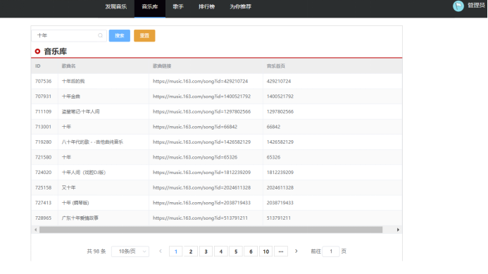


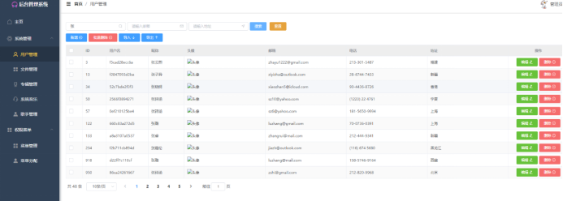

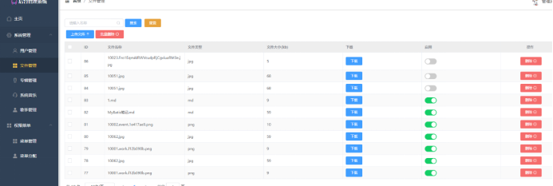

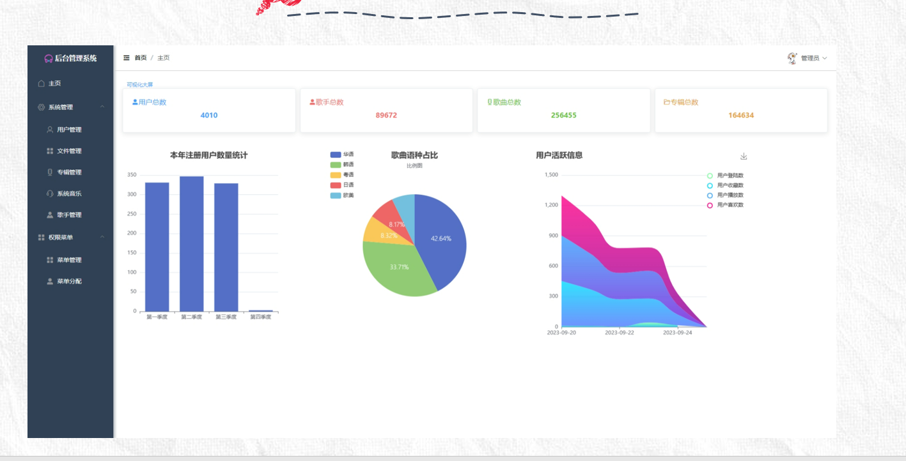

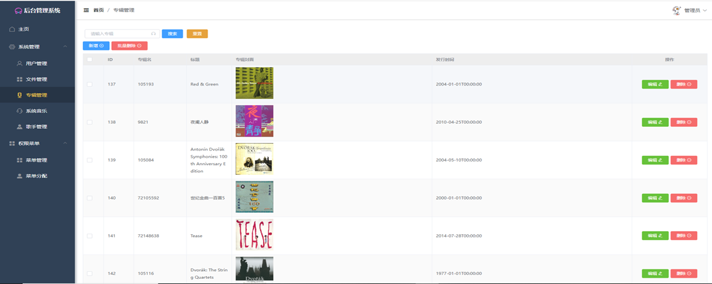


BI大屏

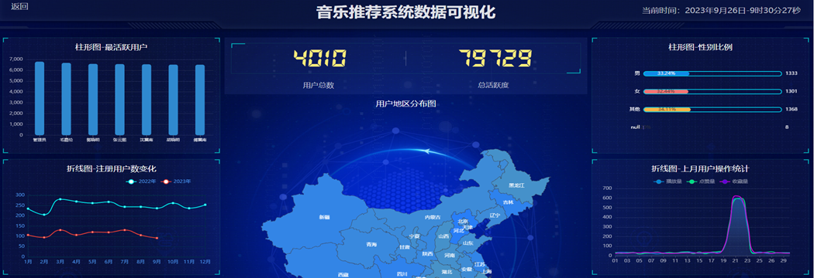

监控大屏

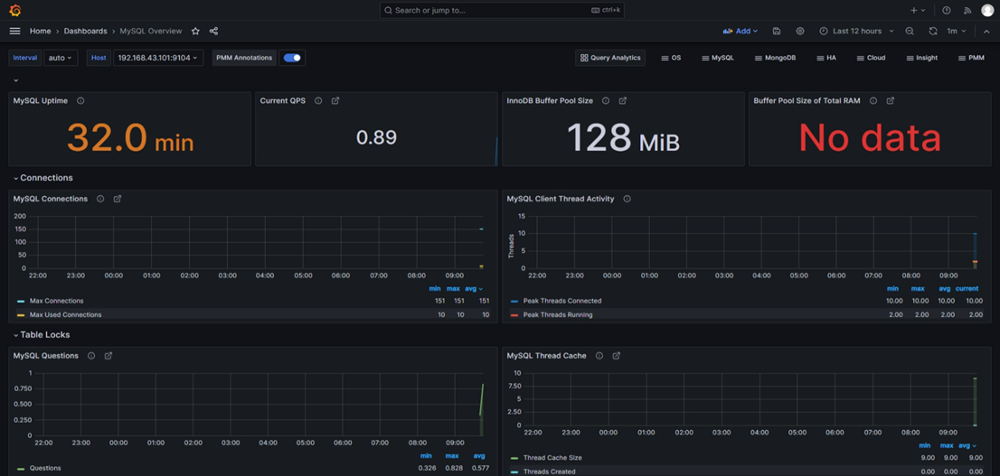